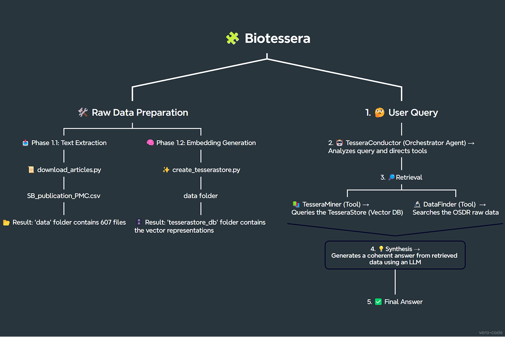

# 🧩 Biotessera: A Space Biology Knowledge Engine

Biotessera is an AI-powered agent system developed for the [**NASA Space Apps Challenge 2025**](https://www.spaceappschallenge.org/2025/find-a-team/biotessera/?tab=project). It transforms hundreds of NASA publications on space biology into a navigable and interactive knowledge mosaic, enabling scientists and mission planners to find precise, synthesized answers backed by source data.

[](https://www.youtube.com/watch?v=NQtkSH8YOfw)

## 🎯 The Problem

NASA's decades of space biology research represent a vast and invaluable resource. However, this knowledge is spread across hundreds of documents, making it difficult to quickly find specific, cross-referenced information needed for planning future long-duration missions.

## 💡 The Solution



Biotessera acts as an intelligent research assistant. It uses a multi-agent architecture (Coordinator/Worker pattern) to address this challenge:
1.  **Data Preparation:** An offline pipeline processes 607 full-text publications, extracts metadata, and generates vector embeddings for every text fragment (a "tessera"). These are stored in a local vector database (`TesseraStore`).
2.  **Retrieval:** The main agent, `TesseraConductor`, receives a user's question and delegates tasks to specialized tools:
    * **`TesseraMiner`**: Searches the local `TesseraStore` for the most relevant **and diverse** text fragments from the 607 publications, utilizing **Maximal Marginal Relevance (MMR)** for enhanced result quality.
    * **`DataFinder`**: Performs real-time searches on the NASA Open Science Data Repository (OSDR) to find related raw datasets.
3.  **Synthesis:** The `TesseraConductor` gathers all retrieved information and uses a Large Language Model (LLM) to generate a single, coherent, and sourced answer.

## ✨ Features

* **Natural Language Q&A:** Ask complex questions in plain English.
* **Multi-Source Answers:** The agent can combine information from its internal knowledge base (`TesseraStore`) and external NASA databases (OSDR).
* **Source-Backed:** Every statement in the generated answer is based on the retrieved data, preventing AI "hallucinations".
* **Modular Architecture:** Easily extendable with new tools to search other databases.

## 🛠️ Tech Stack

* **Backend:** Python
* **AI/ML:** LangChain, Google Gemini (LLM & Embeddings)
* **Vector Database:** ChromaDB
* **Data Processing:** Pandas, BeautifulSoup
* **UI:** Streamlit

## 🚀 How to Run

1.  **Clone the repository:**
    ```bash
    git clone https://github.com/vero-code/biotessera.git
    cd biotessera
    ```
2.  **Set up the environment:**
    ```bash
    python -m venv venv
    source venv/bin/activate  
    # On Windows: .\venv\Scripts\activate
    pip install -r requirements.txt
    ```
3.  **Add your API Key:**
    * Create a `.env` file in the root directory.
    * Add your Google AI API key to it: `GOOGLE_API_KEY="YOUR_API_KEY_HERE"`
4.  **Run the application:**
    ```bash
    streamlit run app.py
    ```

## 🛰️ NASA Data & Resources Used

This project utilizes the following official NASA resources:

* **[A list of 608 full-text open-access Space Biology publications](https://github.com/jgalazka/SB_publications/blob/main/SB_publication_PMC.csv)**: The primary knowledge base for the `Biotessera` agent.
* **[NASA Open Science Data Repository (OSDR)](https://osdr.nasa.gov/bio/repo/)**: Used by the `DataFinder` tool to perform real-time searches for raw experimental datasets.

## 🙏 Acknowledgments

Special thanks to the organizers, mentors, and the entire community of the **NASA International Space Apps Challenge 2025** for making this event possible.

## 📜 License

This project is licensed under the MIT License.